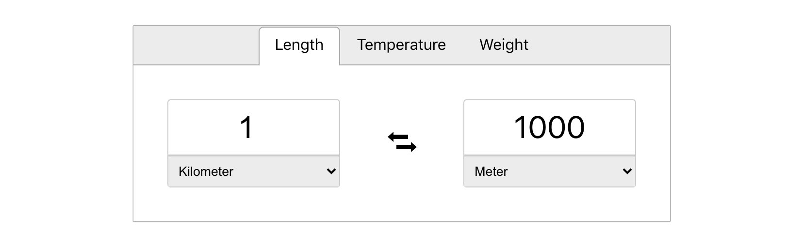

# Conversion Tool
[Demo](https://tbm85.github.io/demo-conversion-tool/)

## Description
A conversion tool made with React JS that allows you to convert units of measure of: length, temperature and weight.

This project was bootstrapped with [Create React App](https://github.com/facebook/create-react-app).

## Resources
* [Icomoon Icons](https://icomoon.io/app/#/select)
* [React-Tabs](https://www.npmjs.com/package/react-tabs)
* [Pixabay](https://pixabay.com/vectors/toolbox-tools-hammer-wrench-304894/)

## How to run this app
* Clone: `git clone https://github.com/TBM85/demo-conversion-tool.git`
* Enter in the directory: `cd demo-conversion-tool`
* Install dependencies: `npm install`
* Start the app: `npm start`